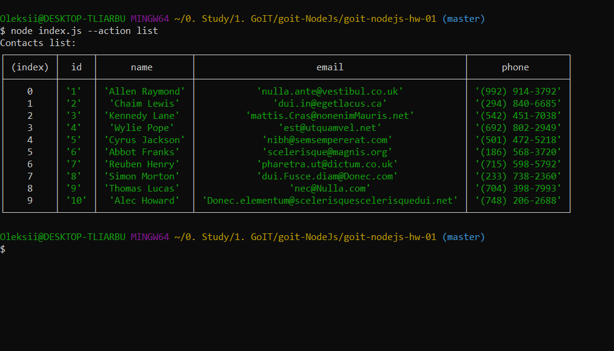
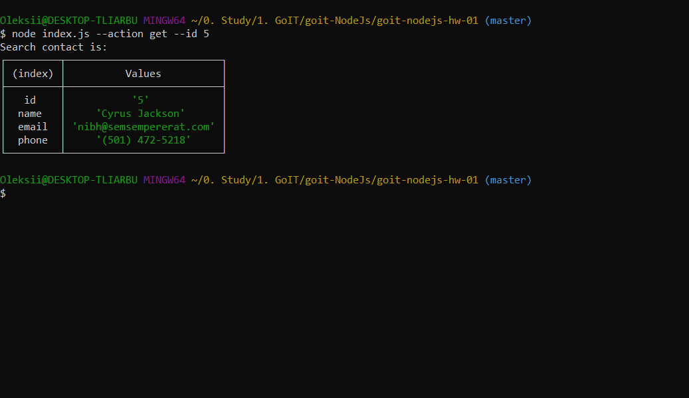
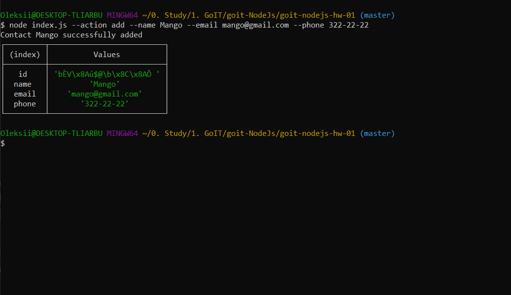
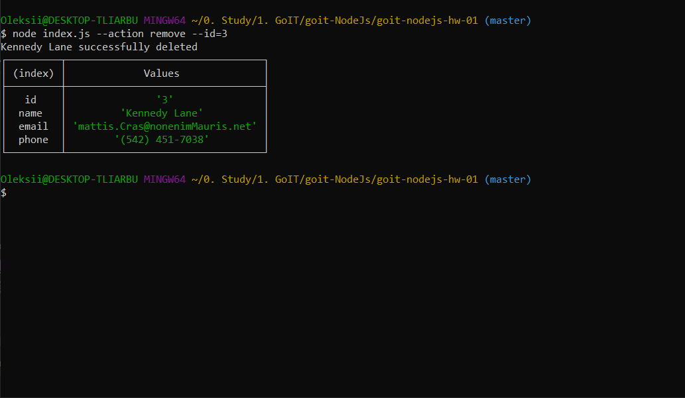

# результати виконання завдання №1
## Результати виконання команд в терміналі

### Отримуємо та виводимо весь список контактів у вигляді таблиці (console.table)
node index.js --action list
 

 
### Отримуємо контакт по id
node index.js --action get --id 5
 

 
### Додаємо контакт
node index.js --action add --name Mango --email mango@gmail.com --phone 322-22-22
 

 
### Видаляємо контакт
node index.js --action remove --id=3
 
